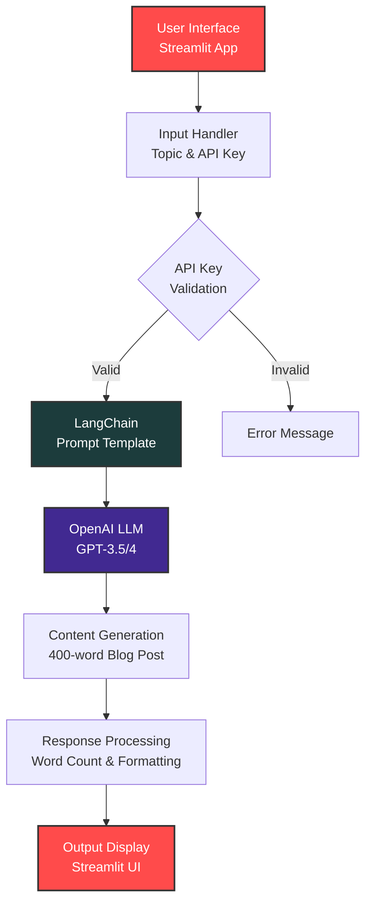

# 📝 Blog Post Generator

<div align="center">


**AI-powered blog post generator for startup and venture capital content**

[🚀 Live Demo](https://59zkcmblm7qcpvfszg9iwl.streamlit.app/) | [📖 Documentation](#usage) | [🐛 Report Bug](https://github.com/yourusername/Blog-Post-Generator/issues)

</div>

---

## 📋 Table of Contents

- [Overview](#overview)
- [Features](#features)
- [Architecture](#architecture)
- [Technology Stack](#technology-stack)
- [Installation](#installation)
- [Usage](#usage)
- [Project Structure](#project-structure)
- [Configuration](#configuration)
- [Contributing](#contributing)
- [License](#license)

---

## 🎯 Overview

Blog Post Generator is an intelligent web application that leverages the power of **LangChain** and **OpenAI's GPT models** to automatically generate high-quality, 400-word blog posts focused on startup and venture capital topics. Built with **Streamlit**, it provides a user-friendly interface for content creators, marketers, and entrepreneurs to quickly produce engaging blog content.

### Key Highlights

- 🤖 **AI-Powered Content Generation**: Utilizes advanced language models for coherent and contextually relevant blog posts
- ⚡ **Fast & Efficient**: Generate professional blog posts in seconds
- 🎨 **User-Friendly Interface**: Clean and intuitive Streamlit-based UI
- 🔒 **Secure API Key Management**: Secure handling of OpenAI API credentials
- 📊 **Word Count Tracking**: Automatic word count verification for generated content

---

## ✨ Features

- **Topic-Based Generation**: Simply enter a topic and generate a complete blog post
- **Professional Writing Style**: Trained to write as an experienced startup and venture capital writer
- **Consistent Format**: Generates exactly 400-word blog posts with word count verification
- **Real-Time Generation**: Instant content generation with progress feedback
- **API Key Security**: Secure input handling for OpenAI API keys
- **Responsive Design**: Works seamlessly across different screen sizes

---

## 🏗️ Architecture



### Architecture Components

1. **Frontend Layer (Streamlit)**
   - User interface for topic input
   - API key management sidebar
   - Real-time content display

2. **Application Layer (LangChain)**
   - Prompt template management
   - LLM orchestration
   - Response formatting

3. **AI Layer (OpenAI)**
   - Language model inference
   - Content generation
   - Token management

4. **Output Layer**
   - Content rendering
   - Word count verification
   - User feedback

---

## 🛠️ Technology Stack

| Technology | Version | Purpose |
|------------|---------|---------|
| **Python** | 3.11 | Core programming language |
| **Streamlit** | 1.37.0 | Web application framework |
| **LangChain** | 0.2.11 | LLM orchestration and prompt management |
| **LangChain OpenAI** | 0.1.19 | OpenAI integration for LangChain |
| **OpenAI API** | Latest | GPT model access |

---

## 📦 Installation

### Prerequisites

- Python 3.11
- Conda (recommended) or pip
- OpenAI API Key ([Get one here](https://platform.openai.com/api-keys))

### Step-by-Step Setup

1. **Clone the repository**
   ```bash
   git clone https://github.com/yourusername/Blog-Post-Generator.git
   cd Blog-Post-Generator
   ```

2. **Create a virtual environment using Conda**
   ```bash
   conda create -n llmapp python=3.11 -y
   conda activate llmapp
   ```

   *Alternatively, using venv:*
   ```bash
   python -m venv venv
   source venv/bin/activate  # On Windows: venv\Scripts\activate
   ```

3. **Install dependencies**
   ```bash
   pip install -r requirements.txt
   ```

4. **Run the application**
   ```bash
   streamlit run main.py
   ```

5. **Access the application**
   - The app will automatically open in your default browser
   - Or navigate to `http://localhost:8501`

---

## 🚀 Usage

### Getting Started

1. **Launch the Application**
   - Run `streamlit run main.py` from the project directory

2. **Configure API Key**
   - Enter your OpenAI API key in the sidebar
   - The key should start with `sk-`

3. **Generate Blog Post**
   - Enter your desired topic in the text input field
   - Click outside the input or wait for auto-generation
   - The blog post will appear below with word count

### Example Usage

```
Topic: "The Future of AI in Startups"
→ Generates a 400-word blog post about AI's role in startup ecosystems
```

### Best Practices

- **Topic Specificity**: More specific topics yield better results
- **API Key Security**: Never commit your API key to version control
- **Token Management**: Be aware of OpenAI API usage and costs

---

## 📁 Project Structure

```
Blog-Post-Generator/
│
├── main.py                 # Main application file
├── requirements.txt        # Python dependencies
├── README.md              # Project documentation
│
└── .gitignore             # Git ignore file (recommended)
```

### File Descriptions

- **`main.py`**: Contains the Streamlit application logic, LangChain integration, and OpenAI API calls
- **`requirements.txt`**: Lists all Python package dependencies with versions
- **`README.md`**: Comprehensive project documentation

---

## ⚙️ Configuration

### Environment Variables (Optional)

For enhanced security, you can use environment variables instead of the sidebar input:

```bash
# Windows PowerShell
$env:OPENAI_API_KEY="your-api-key-here"

# Linux/Mac
export OPENAI_API_KEY="your-api-key-here"
```

Then modify `main.py` to read from environment:
```python
import os
openai_api_key = os.getenv("OPENAI_API_KEY") or st.sidebar.text_input(...)
```

### Customization Options

- **Word Count**: Modify the `template` in `main.py` to change the target word count
- **Writing Style**: Adjust the prompt template to change the writing persona
- **Max Tokens**: Modify `max_tokens` parameter (currently 2048) for longer/shorter posts

---

## 🤝 Contributing

Contributions are welcome! Please feel free to submit a Pull Request. Here's how you can contribute:

1. Fork the repository
2. Create your feature branch (`git checkout -b feature/AmazingFeature`)
3. Commit your changes (`git commit -m 'Add some AmazingFeature'`)
4. Push to the branch (`git push origin feature/AmazingFeature`)
5. Open a Pull Request

### Development Guidelines

- Follow PEP 8 style guidelines
- Add comments for complex logic
- Test your changes before submitting
- Update documentation as needed

---

## 📝 License

This project is licensed under the MIT License - see the [LICENSE](LICENSE) file for details.

---

## 🔗 Links

- **Live Application**: [Streamlit Cloud](https://59zkcmblm7qcpvfszg9iwl.streamlit.app/)
- **OpenAI API Documentation**: [OpenAI Docs](https://platform.openai.com/docs)
- **LangChain Documentation**: [LangChain Docs](https://python.langchain.com/)
- **Streamlit Documentation**: [Streamlit Docs](https://docs.streamlit.io/)

---

## 📧 Contact & Support

For questions, suggestions, or support:

- 🐛 [Report an Issue](https://github.com/yourusername/Blog-Post-Generator/issues)
- 💬 [Start a Discussion](https://github.com/yourusername/Blog-Post-Generator/discussions)

---

<div align="center">

**Made with ❤️ using Streamlit, LangChain, and OpenAI**

⭐ Star this repo if you find it helpful!

</div>
